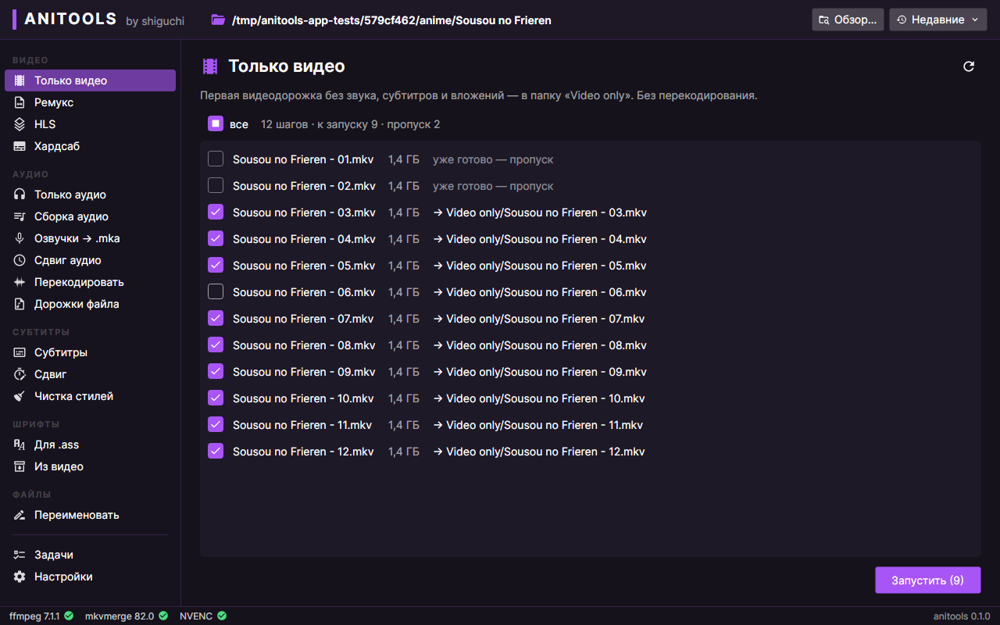

# anitools

Перенос anitools (Python + rich, консоль) на C# с GUI на Avalonia.

- План и полное описание поведения: [docs/PLAN.md](docs/PLAN.md)
- Оригинал (не менять): [reference/python/](reference/python/)



## Установка (Windows)

1. Скачайте **anitools-setup.exe** со страницы [выпусков](https://github.com/sh1guchi/anitools/releases/latest)
   и запустите. Права администратора не нужны. Windows может предупредить «Windows защитила ваш компьютер»
   (у программы нет цифровой подписи) — «Подробнее» → «Выполнить в любом случае».
2. В папке с сериями наберите `ani` в консоли (cmd, PowerShell, Windows Terminal) или в адресной строке
   проводника — откроется anitools в этой папке, консоль закроется сама.
3. Нет ffmpeg или MKVToolNix — нажмите «Установить» на плашке сверху: anitools скачает последние версии сам
   (Настройки → Программы; там же ImDisk для RAM-диска).

Обновления anitools проверяет сам раз в день — кнопка «Обновить» появится сверху. Без установки:
`Anitools.exe` с той же страницы — один файл.

## Структура

| Папка | Что там |
|---|---|
| `src/Anitools.Core` | вся логика, без UI (.NET 10) |
| `src/Anitools.App` | GUI на Avalonia, собирается в `Anitools.exe` |
| `tests/Anitools.Core.Tests` | тесты ядра + golden-эталоны из оригинала (`Golden/`) |
| `tests/Anitools.App.Tests` | headless-тесты окон и скриншоты |
| `tools/gen_golden.py` | снимает эталоны с `reference/python/anitools.py` |

## Сборка и тесты

Нужен .NET 10 SDK (и Python 3.11+ — только для перегенерации эталонов).

```bash
dotnet build
dotnet test
dotnet run --project src/Anitools.App -- "D:\anime\Папка с сериями"
```

Скриншоты экранов тесты пишут в `artifacts/screenshots/` (не в git). Обновить те, что лежат
в [docs/screenshots/](docs/screenshots/):

```bash
ANITOOLS_UPDATE_SCREENSHOTS=1 dotnet test tests/Anitools.App.Tests
```

Эталоны:

```bash
pip install fonttools==4.60.1        # нужен для эталонов шрифтов
python3 tools/gen_golden.py          # перегенерировать
python3 tools/gen_golden.py --check  # проверить, что актуальны
```

## Выпуск версии

1. Поднять `<Version>` в `Directory.Build.props` (например, 1.0.1) — PR, зелёный CI, merge.
2. GitHub → **Actions** → **Release** → **Run workflow** (ветка `main`). Workflow соберёт `Anitools.exe` и
   установщик, проверит установку на чистой Windows, создаст тег `v1.0.1` и выпуск с `anitools-setup.exe`,
   `Anitools.exe` и `SHA256SUMS.txt`. Установленные anitools увидят новую версию сами.

## Статус

- [x] Этап 1 — скелет решения, пустое окно, golden-эталоны
- [x] Этап 2 — чистая логика (anitomy, номера серий, названия…)
- [x] Этап 3 — запуск ffmpeg/MKVToolNix, разбор медиа, операции «Только видео», «Только аудио», «Обработка аудио», «Субтитры», «Ремукс»
- [x] Этап 4 — переименование по номеру серии, поиск названия на Shikimori, откат переименования
- [x] Этап 5 — HLS: 360p…4K в zip + озвучки, подбор качества, резюм, RAM-диск ImDisk
- [x] Этап 6 — доп. инструменты: сборка озвучек в .mka, шрифты для .ass и из видео, хардсаб, сдвиги, чистка .ass, перекодирование аудио
- [x] Этап 7 — GUI: все экраны (п.1–7 и доп. инструменты), очередь задач, настройки, запуск командой `ani`,
  скриншоты — в [docs/screenshots/](docs/screenshots/)
- [x] После этапа 7 — оформление как у Anime Uploader, всплывающие уведомления, запуск exe ≈ втрое быстрее
  (ReadyToRun), AVI в обычном ремуксе
- [ ] Этап 8 — проверка на Windows, см. [docs/PLAN.md §7](docs/PLAN.md)
- [x] Пакет 2 — RAM-диск без запуска от администратора, Shikimori с постерами, «Установить» для программ и др.
- [x] Этап 9 — установщик, команда `ani` без батника (консоль закрывается сама), обновления, выпуск 1.0.0
